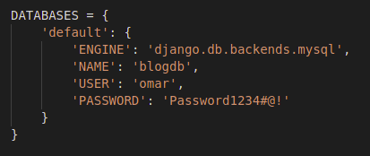

# Django Blog

# Table of contents

- [Steps for running the Project](#steps-for-running-the-project)

- [Navigate our Blog](#navigate-our-blog)

- [Features](#features)

- [TO DOs](#to-dos)

- [Who are we](#who-are-we)

## Steps for running the Project  

1. Clone This Project (Make Sure You Have Git Installed):

  `git clone https://github.com/OmarAbdelzaher/Django-Blog-Project-G1.git`

2. Open mysql or any database manager you want ex: postgres, sqlite (Django Default) and create your own database

3. Set the database type in `settings.py` to mysql and set the database name
    - In case you logged in mysql as root, you don't have to specify your username and password to the database in `settings.py`
    - In case you logged in as a user, you have to specify your username and password to the database

    

4. Set Database (Make Sure you are in directory same as manage.py):

  `python manage.py makemigrations`

  `python manage.py migrate`

5. Create SuperUser to access admin page:

  `python manage.py createsuperuser`

6. Run the server:

  `python manage.py runserver`

7. Enter your browser http://localhost:8000/dj_blog/landing. Also, you can login via admin in http://localhost:8000/admin/

Then you are Good To Go ...

## Navigate our Blog
